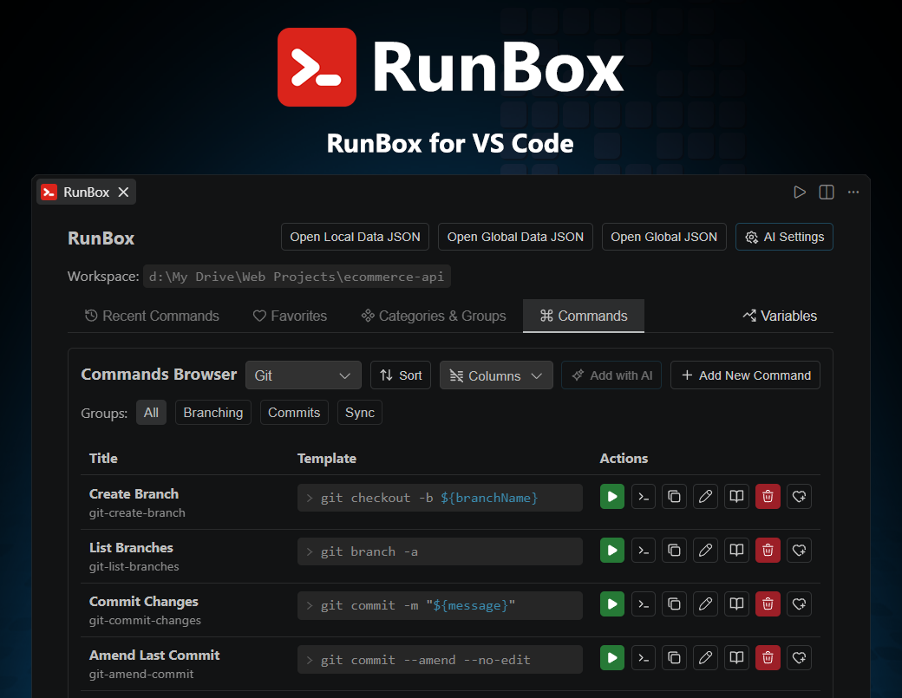
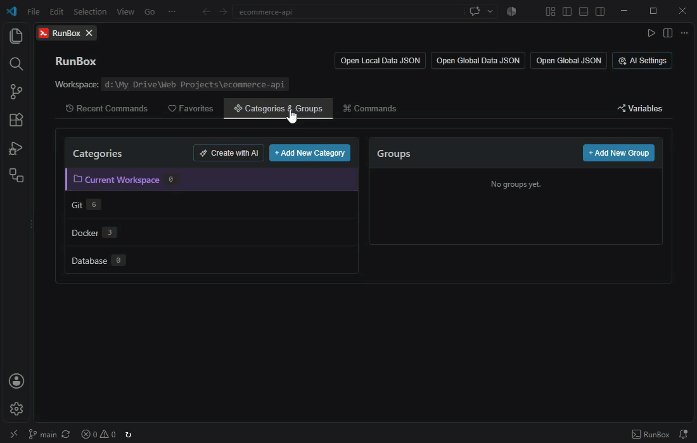
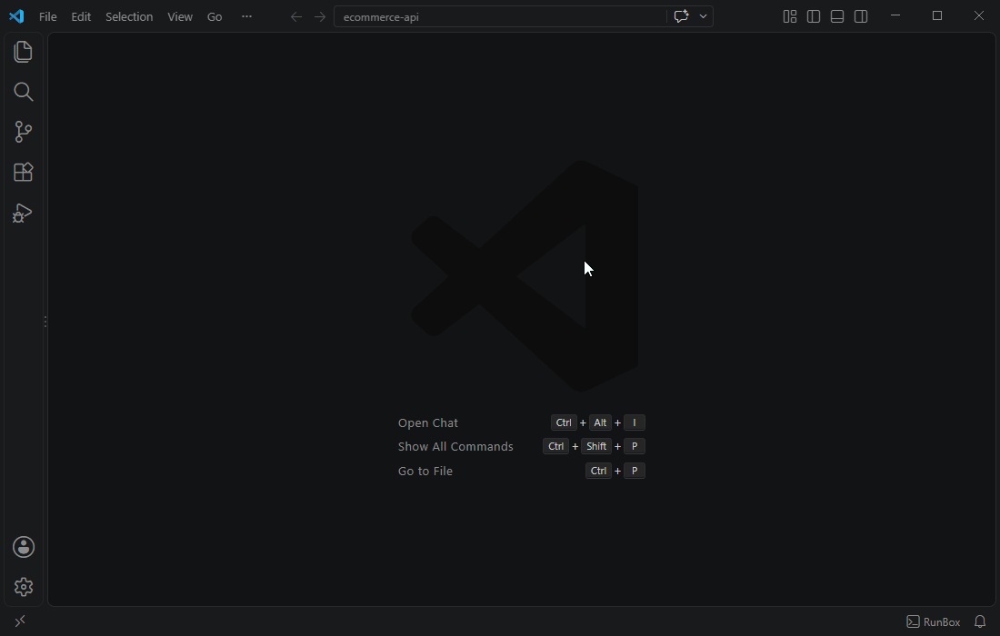
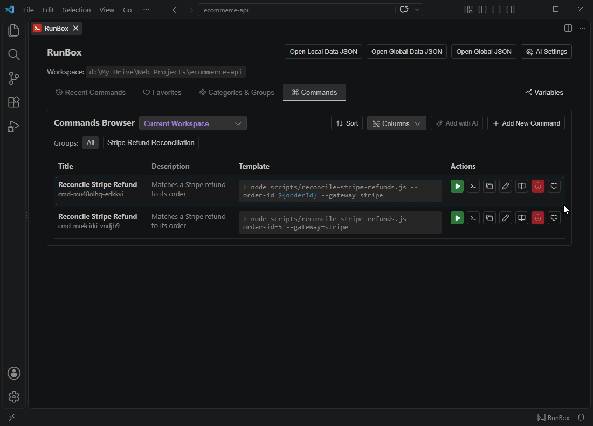

# RunBox

**Organize, run, and generate terminal commands with variables, favorites, and a built-in AI assistant.**

RunBox gives you a central panel inside VS Code to store and run your frequently used terminal commands. Organize them by category and group, define reusable variables, and execute them with a single click across every project you work on.

## Key Features

### 📂 Categorized Command Management

Organize commands into **categories** and **groups** (e.g. MySQL → Setup, Build, Deploy). Create, rename, and delete both. Filter the command table by category and group, toggle visible columns, and drag rows to reorder them within a group.

---

### 🗂️ Current Workspace

A special category that always appears first in the list whenever a workspace folder is open. Commands and groups added under **Current Workspace** are stored privately inside `.vscode/runbox.data.json` (or your configured `runBox.localWorkspaceFilesPath`) instead of the shared global file, so they only ever show up in this exact workspace folder, never in any other project.

This is useful for commands that only make sense for one specific project, such as a project-specific build script or a database connection string, that you never want showing up when you open a different project.

> Commands under **Current Workspace** can only be added to **Local Workspace favorites** (never Global), and their variables can only use the **Local** or **Off** scope (never Global).

---

### ⚡ Three Ways to Run a Command

| Action   | What it does                                                               |
| -------- | -------------------------------------------------------------------------- |
| **Run**  | Executes the command immediately (with a confirmation dialog)              |
| **Use**  | Pastes it into the terminal input so you can review or edit before running |
| **Copy** | Copies the resolved command to your clipboard                              |

---

### 🖥️ Target Shell Selection

Assign a specific target shell (PowerShell, CMD, Bash, and more) to any command from the Add/Edit form. When you click **Run**, RunBox automatically detects a matching terminal profile on your machine and pre-selects it in the confirmation dialog, you can still override it manually before confirming. AI-generated commands can also target a specific shell so the syntax matches.

---

### 🔤 Variables - Three Independent Scopes

Add `${variableName}` placeholders to any command template. When you run or use a command, a dialog prompts you to fill in the values.

Each variable can be saved in one of three independent scopes:

| Scope      | Saved to                                    | Best for                               |
| ---------- | ------------------------------------------- | -------------------------------------- |
| **Local**  | `.vscode/runbox.data.json`                  | Values that differ per project         |
| **Global** | `~/.runbox/data.json`                       | Values shared across all projects      |
| **Off**    | Session memory only - never written to disk | One-time values you don't need to keep |

Switching the scope toggle never deletes the value stored in the other scopes.

### 🔤 Auto Variables

**Auto Variables** (`${date}`, `${username}`, `${workspaceFolder}`, `${workspaceName}`) resolve automatically without any input.

### 🔤 Enum Variables

**Enum Variables** let you predefine a fixed list of options that appear as a dropdown at run time.

---

### 🗃️ Multi-Root Workspace Support

A workspace folder selector appears in the panel header when working with a multi-root workspace. Local variables, local favorites, and auto variables like `${workspaceFolder}` and `${workspaceName}` automatically reflect the selected folder. The Run confirmation dialog also includes a per-execution folder override that sets the terminal's working directory.

The folder resolution behavior when opening the panel is controlled by the `runBox.multiRootFolderResolution` setting - see the [Settings Reference](docs/settings.md) for the available modes.

---

### ✨ Generate Commands with AI

Describe what you need in plain language (e.g. "commands to manage a MySQL database") and the AI produces a set of ready-to-insert commands. Review the results, select the ones you want, and insert them directly into a category and group.

**8 AI providers supported:** Google Gemini · OpenAI · Anthropic Claude · DeepSeek · Groq · Mistral AI · Cohere · StepFun

> Several providers offer **free tiers** - Gemini, DeepSeek, and Groq are good starting points.

---

### 📖 Explain Command with AI

Click the **Explain** button on any command to get a structured breakdown: what it does, what each part means, practical examples, and warnings, rendered directly inside the panel.

---

### ⭐ Favorites

Mark any command as a favorite with **Global** or **Workspace** scope. Quick-add with a single click, or Ctrl+click to manage the scope. Jump back to the original command from the Favorites tab at any time.

---

### 🕘 Recent Commands

Every command you run is tracked automatically. Revisit or re-run recent commands without searching the full list.

---

### 💾 Command Storage, Backup & Sharing

All commands and categories are stored globally in a single JSON file on your machine: `~/.runbox/commands.json`, shared across every VS Code workspace you open. Open and edit it directly from the panel with the **Open Global JSON** button in the header.

Back it up or commit it to a shared repository to sync your commands across machines, or share them with your team, anyone with this file can restore your full set of commands by placing it at the same path on their machine.

---

### 🪟 Safe Across Multiple Windows

Open RunBox in as many VS Code windows as you like — the same project twice, or several different projects at once — without worrying about lost data. Saves are always written safely to disk, adding or removing a command in one window never erases what another window just saved, and every open window updates live to reflect changes made elsewhere. If two windows happen to edit the exact same command at the same time, a clear dialog lets you choose which version to keep.

---

## Requirements

- VS Code `^1.90.0` or later.

## Getting Started

1. Install the extension from the VS Code Marketplace.
2. Open the panel:
   - **Command Palette** → `RunBox: Open Panel`
   - **Keyboard shortcut** → `F4 F4` (press F4 twice)
3. Create a category and optionally add groups.
4. Add your first command with a template.
5. Click **Run**, **Use**, or **Copy** to execute it.

## Keyboard Shortcut

| Shortcut | Action                |
| -------- | --------------------- |
| `F4 F4`  | Open the RunBox panel |

---

## Documentation

- [Settings Reference](docs/settings.md) - all configuration options explained
- [Frequently Asked Questions](docs/faqs.md) - common questions and troubleshooting

---

## License

[Apache-2.0](LICENSE)
