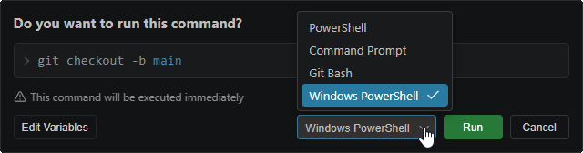
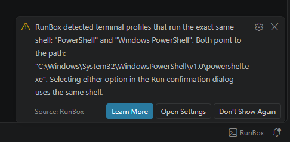
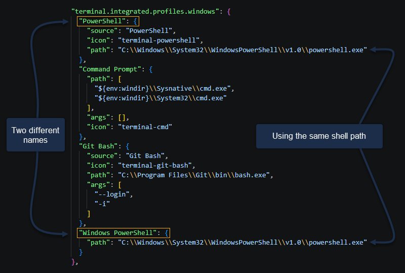

# RunBox — Frequently Asked Questions

<br>

## ➤ General

### ℹ️ Where are my commands stored?

All commands and categories are stored globally in a single JSON file on your machine:

```
~/.runbox/commands.json
```

This file is shared across all your VS Code workspaces, so your commands are always available no matter which project you open. You can open and edit this file directly from the panel using the **Open Global JSON** button in the header.

---

### ℹ️ Does RunBox support multi-root workspaces?

Yes. When you open a multi-root workspace (a `.code-workspace` file with multiple folders), a **workspace folder selector** dropdown appears below the panel header. You can switch between folders at any time — local variables, local favorites, and auto variables like `${workspaceFolder}` and `${workspaceName}` all update to reflect the selected folder.

The **Run confirmation dialog** also includes a per-execution folder override so you can run a specific command against a different folder without changing the panel's active selection. The terminal will open in the chosen folder's directory.

The folder resolution behavior when opening the panel is controlled by the `runBox.multiRootFolderResolution` setting. See the [Settings Reference](settings.md) for details.

---

### ℹ️ What is "Current Workspace" in the Commands Browser?

**Current Workspace** is a special entry that always appears first in the category list — both in the **Categories & Groups** tab and the **Commands Browser** dropdown on the **Commands** tab — whenever a workspace folder is open. Unlike regular categories, commands and groups added under **Current Workspace** are stored privately inside `runbox.data.json` in this project's `.vscode/` folder (or your configured `runBox.localWorkspaceFilesPath`) and are never written to the shared `~/.runbox/commands.json` file. This means they are only ever visible and usable in this exact workspace folder — never in any other project.

This is useful when you have commands that only make sense for one specific project (e.g. a project-specific build script or a database connection string) and you never want them showing up when you open a different project.

The first time you add a group or a command under **Current Workspace**, the extension automatically creates a `runBox.workspaceID` setting for that folder to link the data to it — you don't need to configure anything manually. Until then, the entry is shown empty.

**Limitations:** commands under **Current Workspace** can only be added to **Local Workspace favorites** (never Global), and their variables can only use the **Local** or **Off** scope (never Global) — since these commands never leave this workspace folder, a Global value or favorite would have no other project to ever be read back from.

---

### ℹ️ Is it safe to have RunBox open in multiple VS Code windows at the same time?

Yes. RunBox is designed to be used across multiple VS Code windows at once, whether that's the same project opened twice, or several different projects each running RunBox in parallel — all sharing the same global `~/.runbox/commands.json` file.

- **Every save is written safely.** Files are always written atomically (via a temp file + rename), so a crash or interruption mid-save can never leave a corrupted file on disk.
- **Adding, deleting, or reordering never loses another window's changes.** Each of these actions is applied directly against the current content of the file at the moment of saving, not against a stale copy held in memory — so if another window added a command a second ago, your window's save does not erase it.
- **Other windows update live.** If you add, edit, delete, move, or reorder something in one window, every other open window reflects that change automatically, without needing to close and reopen the panel.
- **Editing the exact same command in two windows at once is the one case that needs your input.** If two windows have the same command open for editing and both try to save, the second window to save sees a dialog explaining that the command was changed elsewhere, showing the newer version, with two choices: **Overwrite anyway** (save your version over it) or **Discard my changes** (reload the newer version instead). This is a rare situation, but it exists specifically so neither window's edit can silently disappear without you noticing.

---

### ℹ️ Can I back up my commands or share them with my team?

Yes. Simply copy `~/.runbox/commands.json` to a safe location or commit it to a shared repository. To restore, replace the file at the same path. Anyone with this file can import your full set of commands by placing it at the same path on their machine.

---

### ℹ️ What is the difference between Run, Use, and Copy?

| Action   | What it does                                                                                                              |
| -------- | ------------------------------------------------------------------------------------------------------------------------- |
| **Run**  | Sends the resolved command to the terminal and executes it immediately. A confirmation dialog appears first.              |
| **Use**  | Pastes the resolved command into the terminal input without pressing Enter — so you can review or edit it before running. |
| **Copy** | Copies the resolved command to your clipboard. Nothing is sent to the terminal.                                           |

---

<br>

## ➤ Variables

### ℹ️ How do the three variable scopes work?

Every variable in a command can be saved in one of three independent scopes. The **Local / Off / Global** toggle on each variable row controls which scope is active for that variable:

| Scope      | Where the value is saved                                      | When to use it                                                                                            |
| ---------- | ------------------------------------------------------------- | --------------------------------------------------------------------------------------------------------- |
| **Local**  | `.vscode/runbox.data.json` inside your current project folder | When the value is specific to this project (e.g. a database name, a port number that differs per project) |
| **Global** | `~/.runbox/data.json` in your home directory                  | When you use the same value across all your projects (e.g. your username, a shared server address)        |
| **Off**    | In memory only — never written to disk                        | When you want to fill in a value just for this session without saving it anywhere                         |

Switching the toggle does **not** delete the value stored in the other scopes — each scope stores its value independently.

### ℹ️ What are Auto Variables?

---

Auto Variables are built-in variables that are resolved automatically without any input from you:

| Variable             | Resolved value                                                                                                                          |
| -------------------- | --------------------------------------------------------------------------------------------------------------------------------------- |
| `${date}`            | Today's date (configurable format)                                                                                                      |
| `${username}`        | Your operating system username                                                                                                          |
| `${workspaceFolder}` | The full path to the active workspace folder. In multi-root workspaces, reflects the folder selected in the panel's workspace selector. |
| `${workspaceName}`   | The folder name (basename) of the active workspace folder. In multi-root workspaces, reflects the selected folder.                      |

> [!NOTE]
> **Multi-root workspaces:** `${workspaceFolder}` and `${workspaceName}` always reflect the folder that is currently active in the panel. Switching the workspace folder dropdown updates these values for all subsequent command executions. You can also override them per-execution in the Run confirmation dialog.

---

### ℹ️ What are Enum Variables?

Enum Variables let you define a fixed list of allowed values for a variable. Instead of typing a value manually, a dropdown appears with your predefined options when you run or use the command. This is useful for variables like `${env}` (with options: `dev`, `staging`, `production`) or `${region}`.

To define enum options, open the **Edit Command** form for any command and click the enum manager icon next to the variable name.

---

<br>

## ➤ AI Assistant

### ℹ️ How do I get an API key for the AI assistant?

Each provider has a free option to get started:

| Provider          | Get API Key                                                                         |
| ----------------- | ----------------------------------------------------------------------------------- |
| **Google Gemini** | [aistudio.google.com](https://aistudio.google.com/) — free tier available           |
| **DeepSeek**      | [platform.deepseek.com](https://platform.deepseek.com/) — free tier + very low cost |
| **Groq**          | [console.groq.com](https://console.groq.com/) — free tier with fast inference       |
| **Mistral AI**    | [console.mistral.ai](https://console.mistral.ai/) — free models available           |
| **Cohere**        | [dashboard.cohere.com](https://dashboard.cohere.com/) — free trial available        |
| **StepFun**       | [platform.stepfun.com](https://platform.stepfun.com/) — free model available        |
| **OpenAI**        | [platform.openai.com](https://platform.openai.com/) — paid                          |
| **Anthropic**     | [console.anthropic.com](https://console.anthropic.com/) — paid                      |

Once you have a key, open the panel → click **AI Settings** (⚙️ icon) → select your provider → paste the key → click **Save API Key**.

---

### ℹ️ How do I generate commands with AI?

1. Go to the **Categories & Groups** tab and select a category and group.
2. Click **Create with AI** — or go to the **Commands** tab and click **Add with AI**.
3. Describe what you want in plain language (e.g. "commands to manage a MySQL database").
4. The AI generates a set of commands. Review them, select the ones you want, and click **Insert**.

---

### ℹ️ What does the AI Explain button do?

The **Explain** button (available on each command row) sends the raw command template to the AI and returns a structured breakdown explaining what it does, what each part means, practical examples, and any warnings. The explanation appears directly inside the panel as formatted text.

---

<br>
<br>

## ➤ Troubleshooting

### ℹ️ A command runs in the wrong shell on Windows

By default, the extension uses your active VS Code terminal profile. If you need to run a specific command in a specific shell (e.g. PowerShell vs CMD vs Git Bash), use the **shell selector** dropdown in the Run confirmation dialog to choose the target shell before confirming.

---

### ℹ️ What are terminal profiles, and how does RunBox use them?

A **terminal profile** is a VS Code concept, not something specific to RunBox. It is a named shortcut to a shell program (like PowerShell, Command Prompt, or Bash) that VS Code's integrated terminal can open. You can view and edit your profiles through the Settings UI (search for "terminal profiles") or by editing your `settings.json` file directly (Command Palette -> "Preferences: Open User Settings (JSON)"). The setting name depends on your operating system:

<a name="profile-setting-names"></a>

- Windows: `terminal.integrated.profiles.windows`
- macOS: `terminal.integrated.profiles.osx`
- Linux: `terminal.integrated.profiles.linux`

When you open the **Run confirmation dialog** in RunBox, it includes a dropdown to pick which terminal profile to run the command in. This dropdown lists exactly the same profiles you already defined in your VS Code settings, no more and no less. RunBox does not invent or add any shells you haven't already configured.



Separately, when adding or editing a command, you can set an optional **Target Shell** (Any Shell, Windows PowerShell, PowerShell, Command Prompt, Bash/Git Bash, WSL, Zsh, Sh). This is just a general category describing what kind of shell the command's syntax was written for, it is not the same list as your actual configured profiles. Think of it as "this command speaks PowerShell language" versus the Run dialog's list, which is "here are the actual programs installed and configured on your computer."

> [!NOTE]
> **Windows PowerShell** and **PowerShell** are two different, independently installed programs, not the same thing with two names. Windows PowerShell (5.1) ships built into every Windows PC. PowerShell (7 or newer) is a separate, modern program you install yourself, it runs side-by-side with Windows PowerShell rather than replacing it. Picking the wrong one when both are installed only affects which profile RunBox pre-selects for you, you can always switch it manually in the Run confirmation dialog.

When you run a command that has a Target Shell set, RunBox tries to be helpful: it looks through your configured profiles and pre-selects the first one that matches that general category in the Run confirmation dialog. This is only a convenience suggestion, never a restriction, you can always pick a different profile manually before confirming, and the command still runs normally either way. If none of your profiles match, nothing breaks: RunBox simply keeps whatever profile was previously selected.

---

<a id="duplicate-terminal-profiles"></a>

### ℹ️ RunBox warned me about duplicate terminal profiles, what should I do?

Sometimes VS Code allows two (or more) profile entries, even with different names, to end up pointing at the exact same program on disk. A common example on Windows is a profile named "PowerShell" and another named "Windows PowerShell" both pointing at the same file. When this happens, choosing either one in the Run confirmation dialog produces the exact same terminal session, so the choice has no real effect.

RunBox checks for this situation once, the first time you open the RunBox panel in a given VS Code session. If duplicate profiles are found, it shows a one-time notice naming the affected profiles:



- **Learn More** opens this FAQ section for full context.
- **Open Settings** jumps you directly to your terminal profiles settings.
- **Don't Show Again** dismisses the notice for that exact situation. If your profile setup changes later and a new duplication appears, RunBox shows a fresh notice for that new situation.

> [!NOTE]
> This notice is purely informational. RunBox never changes, deletes, or restricts any of your terminal profiles or settings by itself.

**Why does this happen?** "Windows PowerShell" is the classic version built into every Windows PC, nothing needs to be installed. "PowerShell" (sometimes called "PowerShell 7") is a separate, more modern version that must be installed independently, it does not replace the classic one, both can exist on the same machine at the same time. A profile's name is just a label, it does not guarantee which actual program that profile points to. This is exactly why two differently-named profiles can end up pointing at the same underlying program, if whoever set them up pointed both names at the same file.

**How to check and fix it:**

1. Open the Command Palette (`Ctrl+Shift+P` / `Cmd+Shift+P`) and run "Preferences: Open User Settings (JSON)", or use the **Open Settings** button from RunBox's notice, which jumps here directly.
2. Look for the terminal profiles setting matching your operating system [(see the setting names above)](#profile-setting-names), then click `Edit in settings.json`.
3. Find the profile names mentioned in RunBox's notice, and compare the `path` (or `source`) value under each one.

   

4. If you genuinely have two different programs installed (for example, you installed the newer PowerShell separately) but both profiles point at the same classic path, you can manually update the `path` of one profile to point at the newer program's actual install location instead. The exact install location can vary depending on how PowerShell 7 was installed on your machine, you can find the correct path through the official Microsoft installation methods, or by asking someone technical to help locate it.
5. If you do not have two different programs installed (both names genuinely point at the same one program, a very common and harmless situation), there's nothing to fix: pick either profile in RunBox's Run dialog since both behave identically, and simply dismiss the notice with **Don't Show Again**. This is not a bug and not something you did wrong.

This situation is not a RunBox error and does not prevent you from using RunBox normally in any way. It is purely a heads-up about a VS Code settings detail that most users would otherwise never notice.

> [!NOTE]
> This topic also applies on macOS and Linux, just with different setting names (see above) and different default shell programs (such as zsh, bash, or sh instead of PowerShell/CMD).

---

### ℹ️ The panel is not opening

Use the Command Palette (`Ctrl+Shift+P`) and run **RunBox: Open Panel**, or press `F4 F4` (two consecutive presses of the F4 key).

---

<br>
<br>

## ➤ Related

- [Back to README](../README.md)
- [Settings Reference](settings.md)
